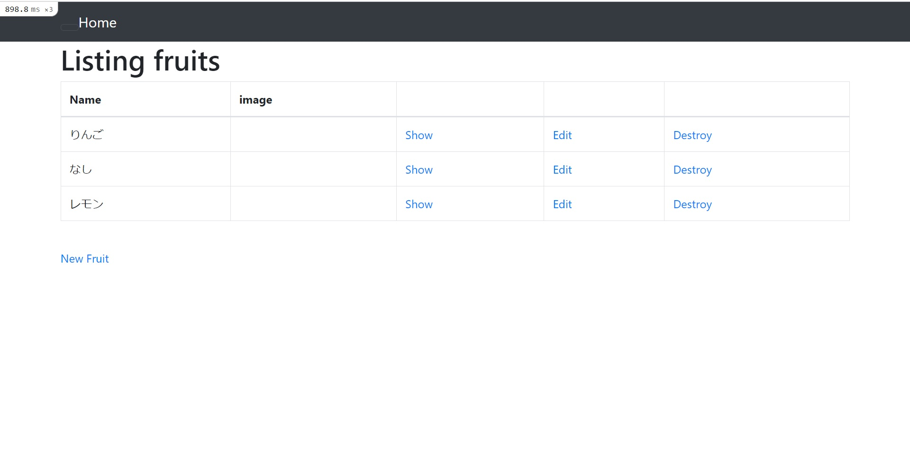
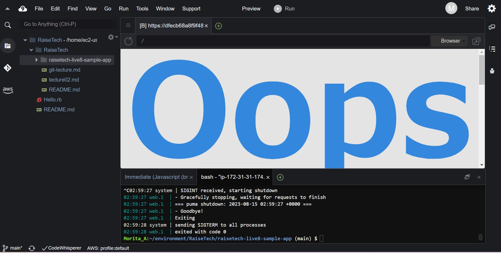
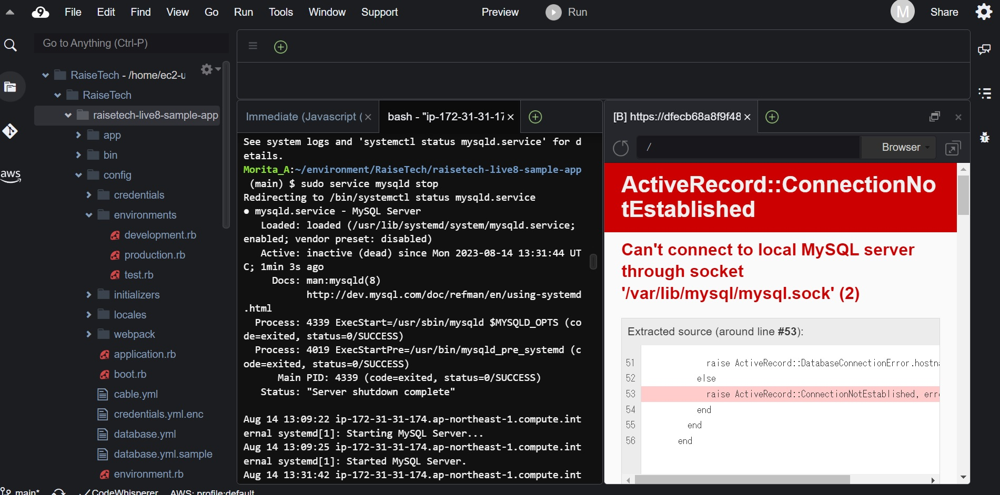
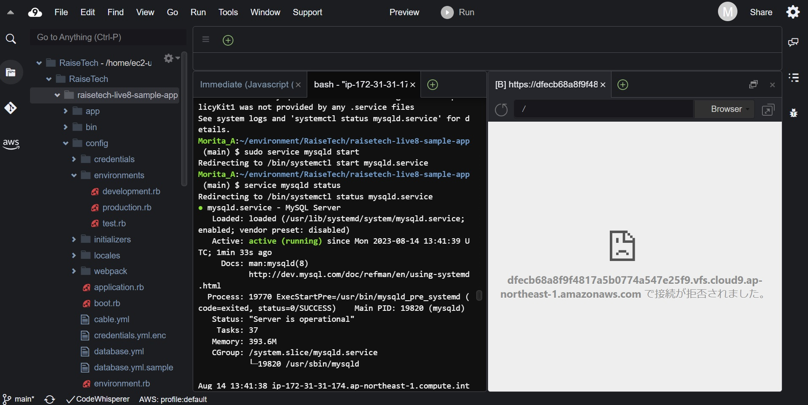

# 第3回講座　サンプルアプリケーションの起動

## 1.サンプルアプリケーションの起動とブラウザでのアクセス  
- サンプルアプリケーションを起動してブラウザでのアクセスを確認  
  

## 2.APサーバーについて  
- 名前：Puma  
- バージョン：5.6.5  
- APサーバーを終了させた場合アクセスできるか  
　→できない  

.jpg)  

## 3.DBサーバーについて  
- 名前：mySQL  
- バージョン：8.0.34  
- DBサーバーを終了させた後、引き続きアクセスできるか  
  →できない  

.jpg)  
- DBを再度稼働  

.jpg)  

## 4.Railsの構成管理ツール  
- 名前：Bundler  

## 5.課題から学んだこと  
1. Webアプリケーション
   - Webブラウザを介して行うアプリケーション
2. クライアントとサーバー
   - webアプリケーションには**クライアント**(利用者)と**サーバー**(提供者)の関係性がある
3. リクエストとレスポンス
   - **API**を叩く(リクエストを送る)
   - リクエストとレスポンスの送り方、ルールをアプリケーション提供者が定義しておくことで、
利用者は「アプリケーションの動作の仕組みを把握していなくても」サーバーから欲しいデー
タを取り出したり、サーバーへデータを送ったりができる
   - 通信フォーマットには**JSON**、**XML**がある
4. 通信
   - **URL**(Uniform Resource Locator)が必要：サーバーがどこにいるかを示す場所
   - **URI**(Uniform ResourceIdentifier)の一部
   - リクエストとレスポンスのやり取り**通信**と言う
   - **W3C**：通信の企画を定めている
5. HTTPメソッド
   - リクエストの際に行いたい処理を伝える
   - **GET**：情報を取得したいとき
   - **POST**：情報の登録や更新をしたいとき
6. HTML/CSS/JS
   - **HTML**：画面描画の言語
   - **CSS**：文章の装飾、スタイリングに使う
   - **JavaScript**：ブラウザでのアニメーション表現等を行うプログラミング言語
7. システム開発の流れ
   - **V字モデル**や**W字モデル**がある
8. Ruby on RailsによるWebアプリケーションの起動
   - **RUby on Rails**：Rubyを使用した際によく使われるフレームワーク  
     フォルダーの集まり
9. 外部ライブラリと構成管理
   - 外部ライブラリ：誰かが作った便利機能
   - 様々なフォルダー、指定のバージョンが必要なため**構成管理ツール**を使用してインストールする
   - **RubyGems**：Rubyのリモートリポジトリ
10. GemとBundler
    - **Gem**：パッケージされたアプリケーションモジュール
    - **Bundler**(構成管理ツール)を使って管理する
11. アプリケーションサーバー
    - Ruby、Javaなどプログラムされたアプリケーションを実行するために必要なサーバー
    - Ruby：Puma
    - Java：Apache Tomcat、Wildfly
    - `rails s`で起動
12. DBとSQL
    - DB：データを整理して検索しやすくした情報の集まり
    - **SQL**：DBに対して操作するための言語
13. 課題
    - configにある拡張子sampleをコピーしてdatebase.yml作成
    - datebase.ymlにmySQLパスワード記載
    - mySQLのインストール場所を確認して、datebase.ymlのソケットの記載を変更
    - node.js：プラットフォームの一種。ブラウザ上で動作するJavaScriptをサーバーサイドでも動作させるための実行環境
    - JavaScript：Webページに動きをつけるためのプログラミング言語。サーバー上で動かない。
    - Python、Rubyはサーバー上で動作
    - 代表的なNode.jsのパッケージマネージャーに**npm**と**yarn**がある
    - sudo コマンド：他のユーザー権限でコマンドを実行する（switch user do/substitute user do）
    - 拡張子yml：YAMLのルールで書かれたファイルにつくことが多い拡張子
    - cpコマンド：cp [コピー元]　[コピー先]
    - lessコマンド：テキストファイルの内容を閲覧する
    - ls [オプション] [ディレクトリ名]　ディレクトリ内にあるファイルの一覧を表示  
     lsのみはカレントディレクトリ内にあるファイル一覧を表示  
     オプション  
     -l 長いフォーマットで表示  
     -a (--all) ドットファイルも表示
    - chmod コマンド：ファイル、ディレクトリに対する権限を設定する
     ユーザー区分ごとに権限を設定できる   
　   所有者権限/グループ権限/その他ユーザーの権限  
　   読み取り：r/書き込み：w/実行権限ｘ
